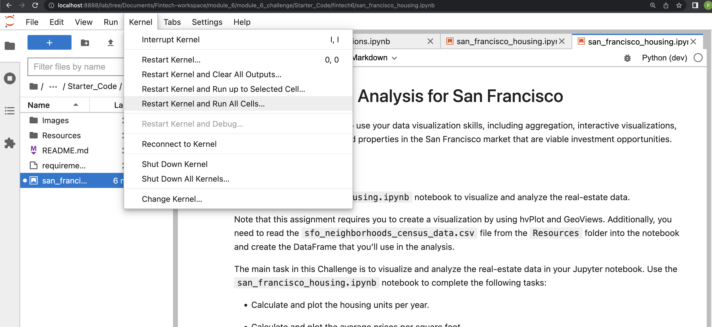

Housing Rental Analysis for San Francisco

## Table of Contents


1. Project Motivation
2. About the Application
3. Techologies Used
4. File Descriptions
5. How to Run
6. License

--------------

## Project Motivation
 This project is in completion of the Columbia University FinTech 2022 bootcamp module six weekly challenge exercise. 


## About the Application

This application analyze San Fransico housing data. It track trends that relate to the price of houses per square foot, in relation to the neighborhood and gross rent. 

-----

## Technologies Used
The application is written in python programming langauge. Users need a device that can run python3 applications. Other python applications, libraries and frameworks used in this project include:

1. jupyterlab
See requirements.txt for list of all libaries used.

---------- 

## File Descriptions
1. Images
    6-4-geoviews-plot.png
    avg-sale-px-sq-foot-gross-rent.png
    pricing-info-by-neighborhood.png
    zoomed-housing-units-by-year.png

2. requirements.txt
3. san_francisco_housing.ipynb
4. README.md
5. Resources
   housing_per_year.csv
   neighborhoods_coordinates.csv
   sfo_neighborhoods_census_data.csv

------------

## How to Run

1. Clone this repo https://github.com/ruejo2013/fintech6.git

2. Navigate to the folder 

  ``` cd <location of file>
    conda create -n <evn_name> python=3.7 
    conda activate <evn_name>
    git clone <link to repo>
    pip install -r requirements.txt 

   
```

    
3. Open the financial_planning_tools.ipynb on jupyterlab in the conda env just activated.




-----------------------------

## License

This project is in completion of the Columbia University FinTech 2022 bootcamp module six weekly challenge exercise. It should not be copied and used for commercial purpose without the authorization of the admin of this repo. For futher information please contact Patrick via email on pruejoma@gmail.com
